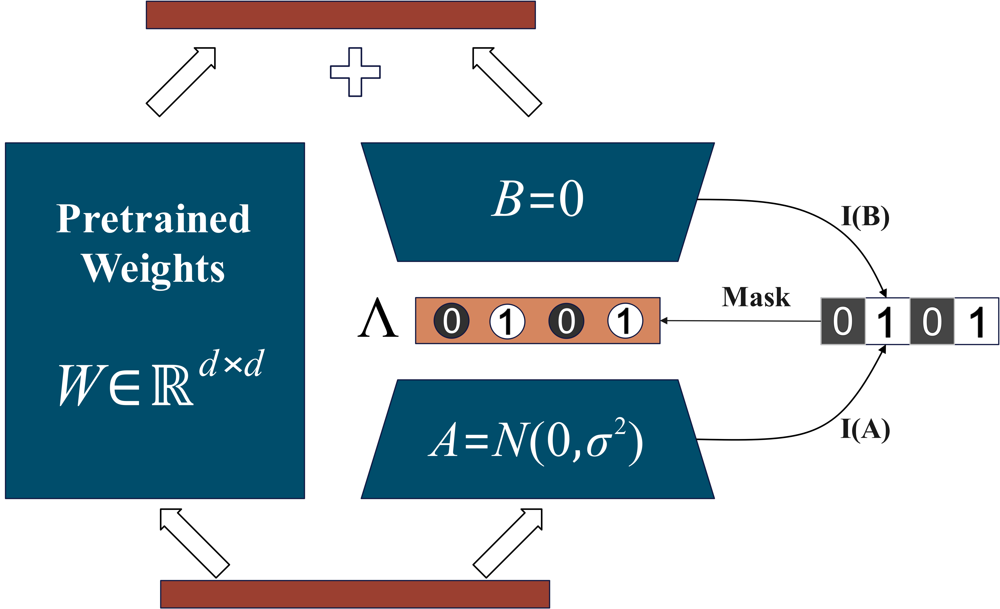

# GaRA: Gated Low-rank Adaptation for Fine-tuning Time-series Foundation Models

<div align="center">
    
</div>


## Introduction

* We propose GaRA, which evaluates the importance of the low-rank adaptation matrix and employs the importance score to suppress and activate gate parameters for rank allocation.
* By calculating the importance score on the validation set, we enhance the generalization performance of the GaRA method.
* We conduct comprehensive experiments on time series forecasting tasks using various pre-trained time series models. 

### Key Challenges:
1. **Challenge 1**: Implementing the "suppression" and "activation" of parameters based on the importance of incremental matrices.
2. **Challenge 2**: Ensuring that our importance evaluation method is robust and enhances generalizability.
In this paper, we propose GaRA, a gated low-rank adaptation method that allows the model to adaptively update the gate parameters based on gradient importance during training. 

## Requirements

To install and use this project, ensure that you have the following software and libraries installed:

- Python >= 3.8
- [Library 1] (e.g., `numpy>=1.19`)
- [Library 2] (e.g., `torch>=1.7`)
- [Additional dependencies]

You can install the required dependencies by running the following command:

```bash
pip install -r requirements.txt
```
##Datasets
- dataset/
    - train/
    - test/
    - validation/

##Usage
To train the model with the default settings, run the following command:
```bash
python train.py --config config.json
```

